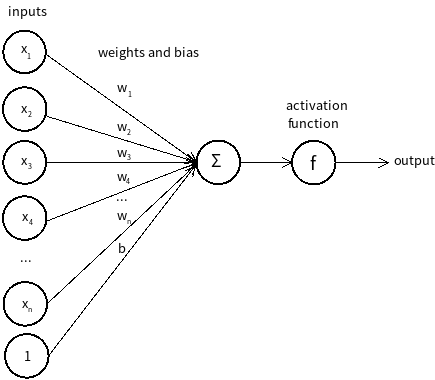
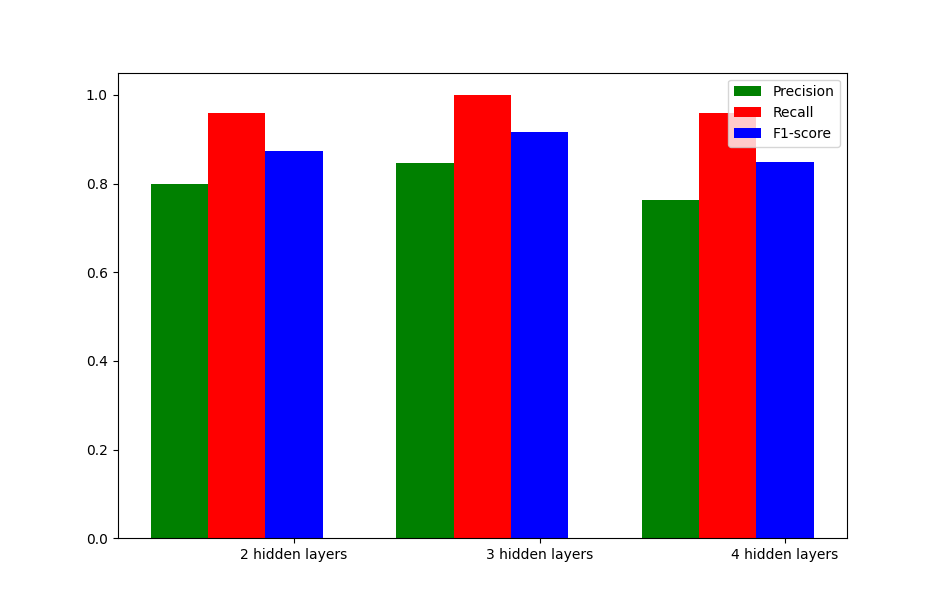

# Climate Change Misinformation Detection
This is the project 1 of NLP in 2020 S1.

Author: Xinnan SHEN

Completed Date: 06-05-2020

## Project Introduction
These days, climate change has become a big problem that has a significant effect on our life. Some issues caused by climate change such as global warming, the melting of icebergs and the rising of sea levels have triggered serious consequences. Thus, it is quite essential to know accurate information about climate change and do our best to reduce the impact caused by it. However, it is not very easy to distinguish these documents with climate change misinformation from the documents without it just by hand, because their contents look quite similar. Therefore, it is quite useful to design and implement a system to automatically help people distinguish between the documents and tell us whether a given document contains climate change misinformation. In my project, the system is implemented by using machine learning methods and natural language processing tools. The results have shown that the model performs quite well and satisfies the anticipated goals despite the occurrence of some errors.

## Project Dataset
The dataset consists of provided dataset and external dataset crawled from the websites, namely NASA [^1]  and VOA [^2]. Specifically, I have downloaded news regarding global climate change from the NASA website and news of some other topics from the VOA website using requests. As the data from the NASA website is the truth about climate change, and the data from the VOA website is about topics other than climate change, so these data aren't climate change misinformation. The external dataset is useful for the climate change misinformation detection system, which will be used in the training process. To make the dataset easier to use, the additional data from the website is converted into JSON format, and each document contains a label (1 represents it is climate change misinformation, while 0 represents it isn't).

[^1]: Global Climate Change, https://climate.nasa.gov/news/.
[^2]: Voice of America, https://www.voanews.com.

## Model Used
1. Random Baseline

The baseline of this project is to predict each document randomly. Despite its poor result, the baseline model is quite useful in this project as I can know whether an enhanced model is good enough by looking at the improvements of the F1 score.

2. Naïve Bayes

We can simply look at how traditional machine learning model performs in this project. For example, we use Naïve Bayes to make predictions. In Naïve Bayes, we assume that each word in a document is generated independently.

3. Deep Neural Networks

The feedforward network consists of three different layers, namely input layer, hidden layer and output layer, and there are normally multiple hidden layers in a feedforward network (see the figure below). 

In each fully-connected dense layer, each unit performs calculation like figure below. 

## Results

This is the results based on dev dataset.

1. Random Baseline

   | Precision | Recall | F1 Score |
   | --------- | ------ | -------- |
   | 0.519     | 0.560  | 0.538    |

2. Naïve Bayes

   | Precision | Recall | F1 Score |
   | --------- | ------ | -------- |
   | 0.686     | 0.960  | 0.800    |

3. Deep Neural Networks

   